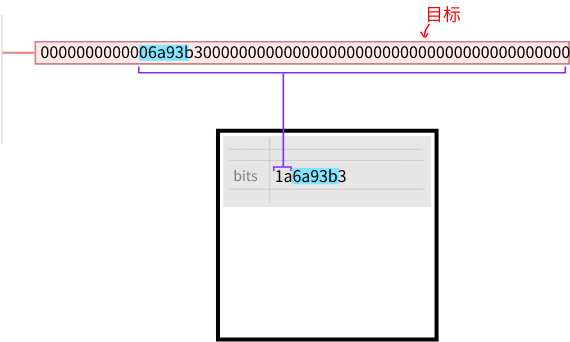

# 比特
一个紧凑的格式中的目标。


位域字段是在[区块头](../../block-header/block-header.md)中紧凑存储[目标值](../../../Mining/Target/Target.md)的一种方式。
## 例子
以下是在挖掘*块406,800*时的目标：
```
Target: 0x00000000000000000696f4000000000000000000000000000000000000000000
```
这是它的块头中你会发现的 Bits 字段：
```
Bits: 0x180696f4
```

## 转换位数
比特是目标的简写。

一开始看起来很陌生，但基本上可以分为两部分：

1. **指数**：这给出了目标的大小（以字节为单位）。
2. **系数**：这给出了目标的最初3个字节。
.png)

因此，如果你想找出在一个块被挖掘时的目标是什么，Bits字段将帮助你计算出它的（稍微舍入）值。

>*Bits -> Target*

>请记住指数是[十六进制数](../../../Other/Hexadecimal/hexadecimal.md)，因此0x18表示十进制下的24字节。

>系数部分取自原始目标总是向上取整。以下是*当前目标*。

>完整的目标通常显示为32个字节的长度，其中包括所有前导的零。但实际上，以下所有内容都是相同的数字：
```
Target: 0x00000000000000000696f4000000000000000000000000000000000000000000
Target: 0x0696f4000000000000000000000000000000000000000000
Target: 0x696f4000000000000000000000000000000000000000000
```

## 为什么要有“比特”？
**问题**：为什么要把目标值转换成“Bits”呢？为什么不直接在区块头中存储完整的目标值？

**答案**：因为区块头不需要存储完整目标值的绝对精度，所以“Bits”格式可以节省空间。