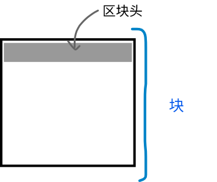
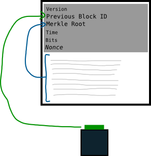

# 块头
一个数据块的摘要。

一个块头就像是一块交易中的元数据。


区块头中的字段提供了整个区块的唯一摘要。


## 例子
这是区块 *123,456 的区块头*：
```
010000009500c43a25c624520b5100adf82cb9f9da72fd2447a496bc600b0000000000006cd862370395dedf1da2841ccda0fc489e3039de5f1ccddef0e834991a65600ea6c8cb4db3936a1ae3143991
```

## 域

|域| 描述|
|---|---|
|型号 |	块的版本|
|前一个块的哈希值| 这个块正在构建的块的[区块哈希](../block-hash/block-hash.md)。这就是将这些块“链接”在一起的方式。|
|[Merkle根](./merkle-root/merkle-root.md)|将该区块中的所有交易一起哈希。基本上提供了该区块中所有交易的单行摘要。|
|时间 | 当矿工尝试挖掘此区块时，该区块头正在进行哈希运算的Unix时间会在区块头本身中被记录。|
|[Bits](../block-header/bits/bits.md) |	目标的简化版本.|
|[Nonce](./Nonce/Nonce.md) |矿工改变的领域，以尝试获得低于目标值的区块头哈希（区块哈希）。|

## 数据结构

|领域|	尺寸|	数据|
|---|---|---|
|版本|	4 bytes|	*Little-endian*|
|前一个区块的哈希值|	32 bytes|	Little-endian|
|Merkle根|	32 bytes|	Little-endian|
|时间|	4 bytes|	Little-endian|
|bitss|	4 bytes|	Little-endian|
|nonce|	4 bytes|	Little-endian|

## 工具
* *哈希块头* - 插入单个块头字段，获取序列化块头和块哈希。