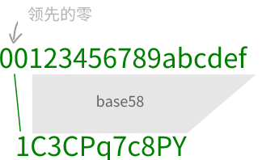

#Base58
用一组易于分享的字符来表示值。
```
  1 2 3 4 5 6 7 8 9
A B C D E F G H   J K L M N   P Q R S T U V W X Y Z
a b c d e f g h i j k   m n o p q r s t u v w x y z
```
Base58是一组字符，您可以使用它们以更短且更用户友好的格式表示大数字。

## “Base58”是什么意思？
“Base”指的是用于表示一个值所使用的字符数。

|基础	|描述|
|---|---|
|2 (二进制)	|01|
|10 (十进制)	|0123456789|
|16 (十六进制)	|0123456789abcdef|
|58	|123456789ABCDEFGH JKLMN PQRSTUVWXYZabcdefghijk mnopqrstuvwxyz|

因此，在日常生活中，我们习惯于使用**基数为10**的数字（使用数字0-9）。

但如果你是一台计算机，使用额外的字符来表示值就很容易：
```
base10(9999) = 9999
base16(9999) = 270f
base58(9999) = 3yQ
```
所有这些“数字”都具有相同的值-**它们只是使用不同的字符集（基数）来表示它。**

>您的基数中拥有的字符越多，您需要使用的字符数量就越少，以表示大数字。因此，您的基数越大，您的“数字”就越短。

## 为什么是base58？

因为58是当您使用所有字母数字字母表中的所有字符（62）时，您剩余的字符数量，但删除所有易于混淆的字符，如0、O、l和I。
```
alphanumeric = 0123456789ABCDEFGHIJKLMNOPQRSTUVWXYZabcdefghijklmnopqrstuvwxyz
base58       =  123456789ABCDEFGH JKLMN PQRSTUVWXYZabcdefghijk mnopqrstuvwxyz
```
因此，Base58具有两个优点：

1. 它提供了一个大的字符集，因此您可以用较短的格式表示大的数字。

2. 它略去了尴尬的字符，以避免您在抄写时出错。

一个讨厌的O/0

## Base58编码

将一个整数（base10）转换为base58，您需要使用**模数**[^1]函数。

基本上，您不断地将数字除以58，在每个步骤中取**余数**以获得base58的下一个**字符索引**，并在没有余数的情况下完成。
```
base10 = 123456789

123456789 % 58 = 19
  2128565 % 58 = 23
    36699 % 58 = 43
      632 % 58 = 52
       10 % 58 = 10

base58 = [10][52][43][23][19]
base58 = BukQL
```
.gif)

Base58编码（简单）
```ruby
# A simple function that converts an _integer_ to base58:

def int_to_base58(i)

  @characters = %w[
      1 2 3 4 5 6 7 8 9
    A B C D E F G H   J K L M N   P Q R S T U V W X Y Z
    a b c d e f g h i j k   m n o p q r s t u v w x y z
]

  # create an empty string (in preparation to hold the new characters)
  buffer = ''

  # keep finding the remainder until our starting number hits zero
  while i > 0
    # find the remainder after dividing by 58 (% = modulus)
    remainder = i % 58

    # add the base58 character to the start of the string
    buffer = @characters[remainder] + buffer

    # divide our integer by 58, and repeat...
    i = i / 58
  end

  return buffer

end

puts int_to_base58(123456789) #=> BukQL
```

## Base58解码

要将一个Base58值转换为Base10，你需要将每个字符的索引乘以该数字在该位置表示的58的数量。

然后将所有这些值加在一起即可。
```
base58 = BukQL

L = 19 * 58^0 = 19
Q = 23 * 58^1 = 1334
k = 43 * 58^2 = 144652
u = 52 * 58^3 = 10145824
B = 10 * 58^4 = 113164960

base10 = 19 + 1334 + 144652 + 10145824 + 113164960
base10 = 123456789
```
.gif)

Base58 解码（简单）
```ruby
def base58_to_int(base58)

  @characters = %w[
      1 2 3 4 5 6 7 8 9
    A B C D E F G H   J K L M N   P Q R S T U V W X Y Z
    a b c d e f g h i j k   m n o p q r s t u v w x y z
    ]
  
  # create an integer to hold the result
  total = 0

  # reverse the base58 string so we can read characters from right to left
  base58 = base58.reverse
  
  # run through each character, including the index so we know how many character we've read
  base58.each_char.with_index do |char, i|
  
    # get the index number for this character
    char_i = @characters.index(char)
    
    # work out how many 58s this character represents (increment the power for each character)
    value  = char_i * (58**i)
    
    # add to total
    total = total + value
  end

  return total

end

puts base58_to_int("BukQL") #=> 123456789
```
## Base58在比特币中的应用

当你想把常用数据转换成更易分享的格式时，比特币中使用Base58。例如：

1. *WIF私钥*
   * *私钥*就像“主密码”，当你想把比特币导入到新钱包时可以使用它。为此，有一种名为WIF私钥的东西，它基本上是一个以Base58表示的私钥。

2. *地址*
   * *公钥*是私钥的“公共对应物”，当你想向某人发送比特币时，需要使用公钥。然而，公钥相当长，所以我们将它们转换成地址，这在转换的最后一步中使用Base58。

**前导零（0x00…）**
>0x: 0x前缀表示**十六进制值**。十六进制值有时只包含数字0-9，因此可能会被误认为是十进制值，因此前缀有助于我们区分它们。在计算之前，该前缀被丢弃。

>字节：一个字节的数据可以保存0-255之间的值，并且可以用两个十六进制字符表示。例如，0xff是一个字节的数据，表示十进制值255。

>**我们将每个十六进制值开头的零字节（0x00）转换为Base58表示中的1。**



你看，把零放在数字前面并不会增加它的大小（例如0x12与0x0012是相同的），因此当我们转换为base58（它使用模数函数）时，任何额外的零在开头将不会影响结果。

因此，为了确保前导零对结果产生影响，比特币base58编码包括一个手动步骤，将所有开头的0x00转换为1。

我不确定为什么在base58中将开头的零字节转换为1，但这就是比特币的工作方式。

## 前缀
在转换为base58之前，将不同的前缀添加到数据中以影响结果的开头字符。然后，该开头字符帮助我们识别每个base58字符串代表什么。

段5：这些是比特币中常用的前缀：
主网:
|前缀（十六进制）|	Base58前导字符|	表示|	示例|
|---|---|---|---|
|00	|1	|P2PKH Address	|1AKDDsfTh8uY4X3ppy1m7jw1fVMBSMkzjP|
|05	|3	|P2SH Address	|34nSkinWC9rDDJiUY438qQN1JHmGqBHGW7|
|80	|K / L|	WIF Private Key 	|L4mee2GrpBSckB9SgC9WhHxvtEgKUvgvTiyYcGu38mr9CGKBGp93|
|80|	5|	WIF Private Key 	|5KXWNXeaVMwjzMsrKPv8dmdEZuVPmPay4nm5SfVZCjLHoy1B56w|
|0488ADE4|	xprv|	Extended Private Key|xprv9tuogRdb5YTgcL3P8Waj7REqDuQx4sXcodQaWTtEVFEp6yRKh1CjrWfXChnhgHeLDuXxo2auDZegMiVMGGxwxcrb2PmiGyCngLxvLeGsZRq|
|0488B21E|	xpub|	Extended Public Key|xpub67uA5wAUuv1ypp7rEY7jUZBZmwFSULFUArLBJrHr3amnymkUEYWzQJz13zLacZv33sSuxKVmerpZeFExapBNt8HpAqtTtWqDQRAgyqSKUHu|

测试网络:
|前缀（十六进制）|	Base58前导字符|	表示|	示例|
|---|---|---|---|
|6F	|m / n	|P2PKH Address|	ms2qxPw1Q2nTkm4eMHqe6mM7JAFqAwDhpB|
|C4	|2	|P2SH Address|	2MwSNRexxm3uhAKF696xq3ztdiqgMj36rJo|
|EF	|c	|WIF Private Key 	|cV8e6wGiFF8succi4bxe4cTzWTyj9NncXm81ihMYdtW9T1QXV5gS|
|EF	|9	|WIF Private Key 	|93J8xGU85b1sxRP8wjp3WNBCDZr6vZ8AQjd2XHr4YU5Lb21jS1L|
|04358394|	tprv|	Extended Private Key|tprv9tuogRdb5YTgcL3P8Waj7REqDuQx4sXcodQaWTtEVFEp6yRKh1CjrWfXChnhgHeLDuXxo2auDZegMiVMGGxwxcrb2PmiGyCngLxvLeGsZRq|
|043587CF	|tpub	|Extended Public Key|tpub67uA5wAUuv1ypp7rEY7jUZBZmwFSULFUArLBJrHr3amnymkUEYWzQJz13zLacZv33sSuxKVmerpZeFExapBNt8HpAqtTtWqDQRAgyqSKUHu|

>如上所述，十六进制前缀00在编码为base58时不会自动转换为“1”。这种转换是在代码中手动执行的。

>您会注意到，*WIF私钥*使用相同的十六进制前缀，但产生不同的前导字符。这是因为如果私钥用于创建压缩的公钥（将产生与未压缩的公钥不同的地址），我们在将其转换为base58之前还会附加一个01。这个额外的字节对base58结果中的前导字符产生影响。

>扩展密钥包含原始公钥和私钥以外的额外元数据，这就是它们的base58字符串更长的原因。

https://en.bitcoin.it/wiki/List_of_address_prefixes

## 代码

这些代码片段执行Bitcoin中使用的base58转换。它们转换为和从十六进制转换，因为那是我们最常使用的格式。
### Ruby:
```ruby
module Base58

  @chars = %w[
      1 2 3 4 5 6 7 8 9
    A B C D E F G H   J K L M N   P Q R S T U V W X Y Z
    a b c d e f g h i j k   m n o p q r s t u v w x y z
]
  @base = @chars.length

  def self.encode(hex)
    i = hex.to_i(16)
    buffer = String.new

    while i > 0
      remainder = i % @base
      i = i / @base
      buffer = @chars[remainder] + buffer
    end

    # add '1's to the start based on number of leading bytes of zeros
    leading_zero_bytes = (hex.match(/^([0]+)/) ? $1 : '').size / 2

    ("1"*leading_zero_bytes) + buffer
  end
  
  def self.decode(base58)
    total = 0 # integer to hold conversion to decimal

    # run through each character
    base58.reverse.each_char.with_index do |char, i|
      char_i = @chars.index(char) # get the index number for this character
      value  = (58**i) * char_i   # work out how many 58s this character represents
      total = total + value     # add to total
    end

    # convert this integer to hex
    hex = total.to_s(16)

    # add leading 00s for every leading 1
    leading_1s = (base58.match(/^([1]+)/) ? $1 : '').size

    ("00"*leading_1s) + hex
  end

end

puts Base58.encode('0093ce48570b55c42c2af816aeaba06cfee1224faebb6127fe') #=> 1EUXSxuUVy2PC5enGXR1a3yxbEjNWMHuem
puts Base58.decode('1EUXSxuUVy2PC5enGXR1a3yxbEjNWMHuem') #=> 0093ce48570b55c42c2af816aeaba06cfee1224faebb6127fe
```

### PHP
```php
<?php

// Sample Input
$hex = "00662ad25db00e7bb38bc04831ae48b4b446d1269817d515b6"; // a public key hash (with a 00 prefix)

// -------------
// Base58 Encode
// -------------
// Convert hex string to an integer
$num = gmp_init($hex, 16);
$base58 = "";

// Base58 Characters
$chars = str_split("123456789ABCDEFGHJKLMNPQRSTUVWXYZabcdefghijkmnopqrstuvwxyz");

// Keep dividing by 58 and taking the remainder as the character
while ($num > 0) {
    $rem = gmp_mod($num, 58); // remainder (what we get the character for)
    $num = gmp_div($num, 58); // quotient  (keep dividing the number to get remainders)
    $base58 = $chars[intval($rem)].$base58; // add base58 char to the start
}

// Convert leading 00s in hex to leading 1s (this is done manually in the base58 conversion)
$count = intval(strspn($hex, "0") / 2); // how many leading 0s, then divide by 2 (to work out how many zero bytes have been prefixed)
$leading = str_repeat("1", $count); // prefix one leading 1 for every zero byte (e.g. 00)

// Result
$result = $leading.$base58;
echo $result.PHP_EOL; // 1AKDDsfTh8uY4X3ppy1m7jw1fVMBSMkzjP

// -------------
// Base58 Decode
// -------------
$base58 = "1AKDDsfTh8uY4X3ppy1m7jw1fVMBSMkzjP";
$int = gmp_init(0); // integer to hold result

// Convert to decimal
$base58a = str_split(strrev($base58));   // create an array we can loop through
foreach ($base58a as $i => $c) {         // run through each character
    $multiple = gmp_pow(58, $i);         // how many 58s this position holds (e.g. 58^0, 58^1, 58^2...)
    $index = array_search($c, $chars);   // get index number for base58 char (e.g. B=10)
    $value = gmp_mul($index, $multiple); // multiply to get number of 58s this character is representing
    $int = $int + $value;                // add to total
}

// Convert to hexadecimal
$gmp = gmp_init(strval($int), 10); // create gmp number from bit string (base 10) NOTE: gmp_init takes strings
$hex = gmp_strval($gmp, 16); // convert to hex string representation
if (strlen($hex) % 2 !== 0) { // return even number of characters (hex2bin prefers it)
    $hex = '0'.$hex;
}

// Convert leading 1s in base58 to leading 00s (this is done manually in the base58 conversion)
$count = strspn($base58, "1");
$leading = str_repeat("00", $count);

// Result
$result = $leading.$hex;
echo $result.PHP_EOL; // 00662ad25db00e7bb38bc04831ae48b4b446d1269817d515b6
```

## 模数（%）
模数（%）函数是除法（/）函数的姐妹函数。它给出除法的余数：
```
7 % 6 = 1
7 % 5 = 2
7 % 4 = 3
7 % 3 = 1
```

## 来源
[src/base58.cpp](https://github.com/bitcoin/bitcoin/blob/0fea960ca917b73aff853fe88476174c8a313863/src/base58.cpp)
## 资源
[github.com - base58.rb](https://gist.github.com/tomtaylor/5457965)
[bitcoin.it/wiki/Base58Check_encoding](https://en.bitcoin.it/wiki/Base58Check_encoding)
[darklaunch.com - Base58 Encoder/Decoder](https://www.darklaunch.com/tools/base58-encoder-decoder)
## 进一步阅读
[purplemath.com - Number Bases](http://www.purplemath.com/modules/numbbase.htm)
## 感谢
[TheSeven](https://github.com/TheSeven) - 在IRC上交流。帮助我理解比特币中如何实现Base58。